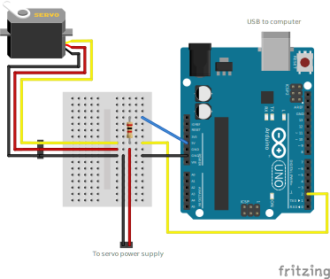

# HitecDServo
Arduino library to program and control [Hitec D-series](https://hitecrcd.com/products/servos/servos/digital/d-series) servos. (Not endorsed by Hitec.)

Hitec D-series servos have many settings that can be programmed using Hitec's proprietary programmer. This Arduino library was developed by reverse-engineering the programmer's serial protocol. The library can program all servo settings, including direction, speed, deadband, range, soft-start, fail-safe, power-limit, overload-protection, and sensitivity. The library can also control the servo's motion, and read back the actual servo position.

(Note: This library is not endorsed by Hitec, not guaranteed to work, and could potentially even damage your servo.)

## Pull-up resistor
The library works with the servo attached to any digital pin, even if not PWM-capable. However, you must attach a 2-kiloohm pullup resistor between the digital pin and the +5V power supply. (If you're using a 3.3V microcontroller, then instead attach a 1-kiloohm pullup resistor between the digital pin and the +3.3V power supply.)



## Using as a library
To program the servo settings from an Arduino sketch, declare a `HitecDServo` instance and use the `writeSettings()` method:
```cpp
#include <HitecDServo.h>

HitecDServo servo;

void setup() {
  int result;

  Serial.begin(115200);

  int servoPin = 2;
  result = servo.attach(servoPin);

  /* Always check that the return value is HITECD_OK. If not, this can indicate
  a problem communicating with the servo. */
  if (result != HITECD_OK) { printError(result); }

  /* Reduce the servo's speed to 50% and reverse the direction. */
  HitecDSettings settings;
  settings.speed = 50;
  settings.counterclockwise = true;
  result = servo.writeSettings(settings);
  if (result != HITECD_OK) { printError(result); }

  /* After writeSettings(), we must wait 1000ms for the servo to reboot. */
  delay(1000);
}

void loop() {
  /* Sweep the servo back and forth between the end points */
  servo.writeTargetMicroseconds(850);
  delay(2000);
  servo.writeTargetMicroseconds(2150);
  delay(2000);
}

void printError(int result) {
  Serial.print("Error: ");
  Serial.println(hitecdErrToString(result));
  while (1) { }
}
```

For full documentation, see [HitecDServo.h](src/HitecDServo.h).

## Using as a programmer
The [Programmer](examples/Programmer/Programmer.ino) example sketch turns your Arduino into an interactive servo programmer. Upload it to the Arduino, then use the Arduino Serial Monitor at 152000 baud to interactively read/write the settings of your Hitec D-series servo that's attached to the Arduino.

## Details

### Supported Hitec D-series servo models
Right now, the library has only been tested with a Hitec D485HW servo. Other models might work, but it's not guaranteed.

Want to help improve support for other Hitec D-series servo models? If you run the [Programmer](examples/Programmer/Programmer.ino) example sketch with an unsupported servo model, it will print some diagnostic information on the Arduino Serial Monitor. Please [open a GitHub issue](https://github.com/timmaxw/HitecDServo/issues/new) with the diagnostic information.

### Supported Arduino models
The library has been tested with an Arduino Uno.

Non-AVR architectures are not supported. (The library synchronously bit-bangs the serial protocol, and this depends on exact instruction cycle counts.)

### Serial protocol details
See [src/HitecDServoInternal.h](src/HitecDServoInternal.h) for notes on the details of the serial protocol between the Hitec DPC-11 programmer and the servo. See [extras/DPC11Notes.md](extras/DPC11Notes.md) for some additional notes about the behavior of the DPC-11 programmer.
